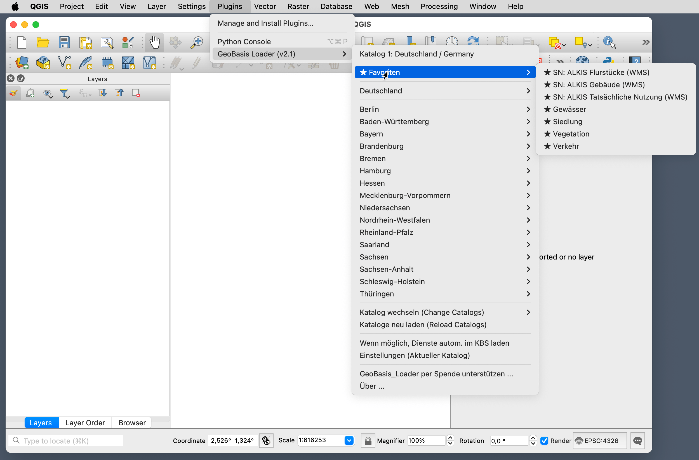

  

<h1 align="center">GeoBasis Loader</h1>

  Geodaten aus ganz Deutschland mit einem Klick in QGIS laden.

  
  
  
  

  <a href="README_EN.md">English version</a> &middot;
  <a href="https://geoobserver.de/qgis-plugin-geobasis-loader/">Website</a> &middot;
  <a href="https://github.com/geoObserver/geobasis_loader/issues">Fehler melden</a>

---

## Was ist GeoBasis Loader?

Das QGIS-Plugin vereinfacht den Zugang zu **WMS-, WMTS-, WFS-, WCS- und VectorTiles-Diensten** aus den Open-Data-Portalen der deutschen Landesvermessungsämter sowie zu Hintergrundkarten wie OSM und Basemap.de. Statt URLs manuell zusammenzusuchen, reicht ein Klick im Plugin-Menü.

## Features

- Zugriff auf Geodienste aller 16 Bundesländer sowie Europa- und Welt-Kataloge
- Unterstützte Dienste: WMS, WMTS, WFS, WCS, OGC API Features, VectorTiles
- Integrierte QGIS-Suche über den Locator (Prefix `gbl`)
- Favoriten-System mit Stern-Markierung für häufig genutzte Dienste
- Automatische Koordinatensystem-Erkennung
- Redundante Server mit automatischem Fallback
- Lokaler Cache für schnellen Offline-Zugriff auf Katalogdaten

## Screenshot

  

## Installation

### Über den QGIS Plugin Manager (empfohlen)

1. QGIS öffnen
2. **Erweiterungen** > **Erweiterungen verwalten und installieren...**
3. Nach **GeoBasis_Loader** suchen
4. **Erweiterung installieren** klicken

### Manuelle Installation

1. Die neueste ZIP-Datei von der [Releases-Seite](https://github.com/geoObserver/geobasis_loader/releases) herunterladen
2. In QGIS: **Erweiterungen** > **Erweiterungen verwalten und installieren...** > **Aus ZIP-Datei installieren**
3. Die heruntergeladene ZIP-Datei auswählen

## Schnellstart

**Schritt 1** &mdash; Nach der Installation erscheint im Erweiterungen-Menü der Eintrag **GeoBasis Loader**. Dort einen Katalog wählen (z.B. *Deutschland*).

**Schritt 2** &mdash; Im Menü das gewünschte Bundesland und Thema auswählen (z.B. *Sachsen > Digitale Orthophotos*).

**Schritt 3** &mdash; Das passende Koordinatensystem auswählen oder die automatische Erkennung nutzen. Der Layer wird direkt in das aktuelle Projekt geladen.

> **Tipp:** Mit dem Locator (Tastenkürzel `Strg+K`) und dem Prefix `gbl` lassen sich Themen direkt per Textsuche finden.

## Favoriten

Häufig genutzte Dienste lassen sich als Favoriten markieren:

1. **Einstellungen** öffnen (im Plugin-Menü)
2. Im Reiter *Themen* die gewünschten Einträge in der Spalte **Favorit** anhaken
3. Nach dem Speichern erscheint im Plugin-Menü eine eigene **Favoriten**-Sektion mit allen markierten Einträgen (gekennzeichnet mit &#9733;)

Favoriten bleiben auch nach Plugin-Updates erhalten, da sie im QGIS-Profil gespeichert werden.

## FAQ

**Ein Dienst ist nicht verfügbar oder zeigt keine Daten an.**
Die Verfügbarkeit hängt ausschließlich vom jeweiligen Datenanbieter ab. Falls ein Link veraltet ist, gerne ein [Issue erstellen](https://github.com/geoObserver/geobasis_loader/issues) oder eine Mail an [news@geoobserver.de](mailto:news@geoobserver.de?subject=GeoBasis_Loader_Input:) senden.

**Welches Koordinatensystem soll ich wählen?**
Im Zweifelsfall passt EPSG:25832 (UTM Zone 32N) für den Großteil Deutschlands. Die Option *Automatisches KBS* im Plugin-Menü übernimmt das Koordinatensystem des aktuellen Projekts, wenn es vom Dienst unterstützt wird.

**Wie aktualisiere ich die Katalogdaten?**
Im Plugin-Menü den Eintrag **Kataloge neu laden** wählen. Die Kataloge werden von redundanten Servern geladen; bei Ausfall eines Servers erfolgt automatisch ein Fallback.

**Unterstützt das Plugin QGIS < 3.44?**
Ab Version 2.0 wird QGIS 3.44+ (Qt6) vorausgesetzt. Für ältere QGIS-Versionen steht die Plugin-Version 1.3 zur Verfügung.

## Mitwirken

Beiträge sind willkommen! Möglichkeiten:

- **Fehlerhafte URLs melden** &mdash; [Issue erstellen](https://github.com/geoObserver/geobasis_loader/issues)
- **Neue Dienste vorschlagen** &mdash; Per Issue oder Mail an [news@geoobserver.de](mailto:news@geoobserver.de?subject=GeoBasis_Loader_Input:)
- **Code beitragen** &mdash; Fork erstellen, Änderungen auf einem Feature-Branch entwickeln, Pull Request einreichen

## Lizenz

Dieses Projekt steht unter der [GNU General Public License v3.0](LICENSE).

## Danksagung

- **Anton May** &mdash; für die Unterstützung bei der Entwicklung
- **Mike Elstermann ([#geoObserver](https://geoobserver.de))** &mdash; Projektinitiator und Maintainer
- Allen Datenanbietern, die ihre Geodienste als Open Data bereitstellen

---

  
   
  Gefällt das Plugin? Unterstützung per Spende ist herzlich willkommen.

---

Haftungshinweis

Die in diesem Plugin genutzten Links (URLs) auf die Dienste der Anbieter werden mit größtmöglicher Sorgfalt recherchiert und implementiert. Fehler im Bearbeitungsvorgang sind dennoch nicht auszuschließen. Eine Haftung für die Verfügbarkeit, Richtigkeit, Vollständigkeit und Aktualität dieser Links kann trotz sorgfältiger Prüfung nicht übernommen werden. Es gelten die vom jeweiligen Anbieter beschriebenen Nutzungsbedingungen.

